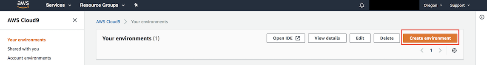
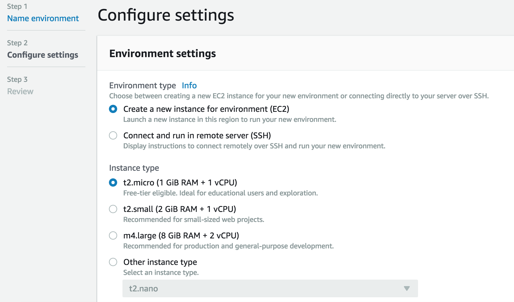
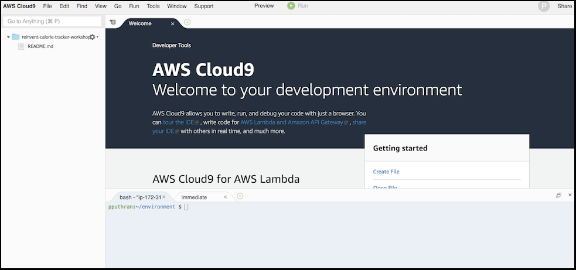

# Module 1: Preparing your AWS Cloud 9 Development Environment

AWS Cloud9 is a cloud-based integrated development environment (IDE) that lets you write, run, and debug your code with just a browser. 

In this section, we will create a AWS Cloud9 (C9) environment and configure it to access AWS resources.

1. Open the [AWS Cloud9 console](https://console.aws.amazon.com/cloud9/)

2. Choose **Oregon** region. Please ensure you are in the correct AWS region.

  	

3. Click **Create Environment**.

4. Provide a name, **reinvent-twitter-session** and Click **Next Step**.

5. Under **Environmnent Settings**, choose **Create a new instance for environment (EC2)** and **Instance type** as **t2.micro**.

  	

6. Click **Next Step** and click **Create Environment**. This will take 3-5 minutes to create the environment.

7. Once your environment is ready, you will see the following screen. The top half is the welcome page and code editor window. And the bottom half is your terminal window.

  	


8. Go to the Cloud9 console and within the terminal windows, let's update the aws-cli and install sam cli:
	```
	$ sam --version
	v0.6.2
	```
	No need to update if same version else:
	
    ```pip install aws-sam-cli --user```

## Cloning the project

Within your AWS Cloud9 environment, clone the workshop GitHub repo.

```
$ git clone https://github.com/kx74/aws-twitter-bot.git
```

---

**Congratulations!!!** You have completed setting up your AWS Cloud9 environment and have cloned the project. 

[Go back to the home page](../README.md)
