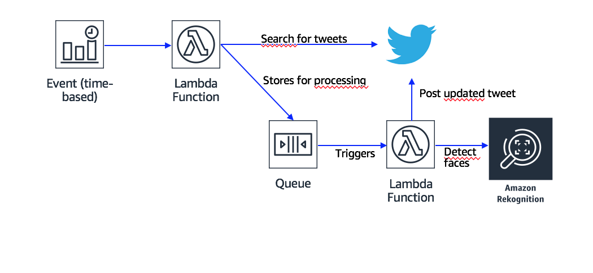

# Poller and Image Updater

## Architecture Overview

## Steps
- Let's create an Amazon SQS **Standard** queue, the name will be passed to the lamnda through an environment variable (e.g: testMessage) [Amazon SQS](https://console.aws.amazon.com/sqs/home?region=us-west-2#)

- [Phase 1: Let's check twitter every 5 minutes to gather tweets with specific keywords and images](./Poller/)

- [Phase 2: Let's get the messages in the queue and update the image, tweet the updated image](./ImageUpdate/)
