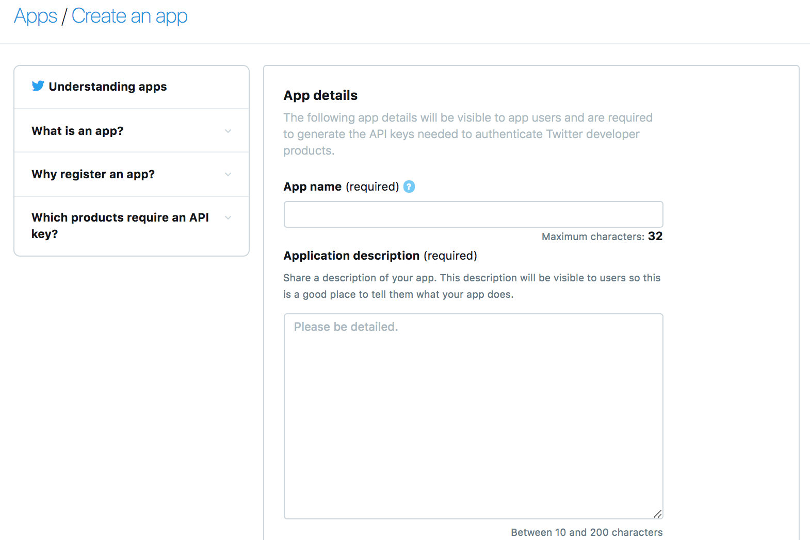
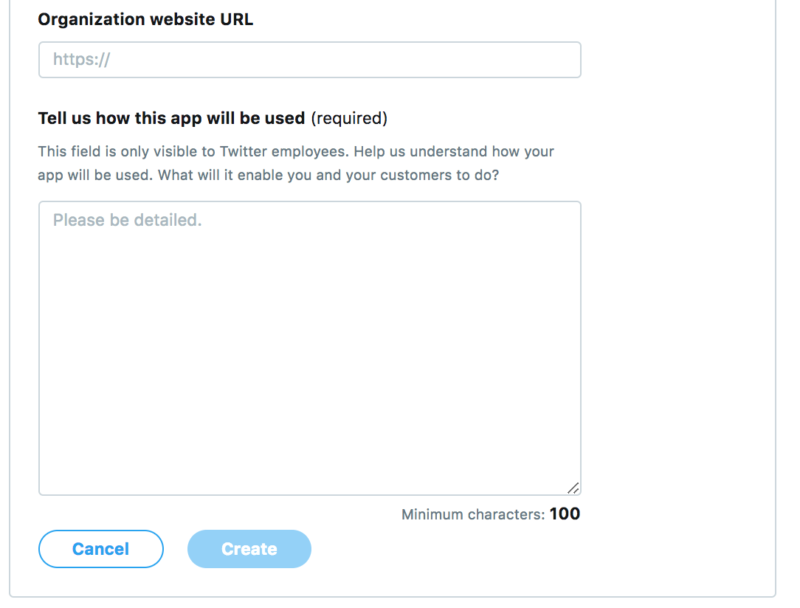
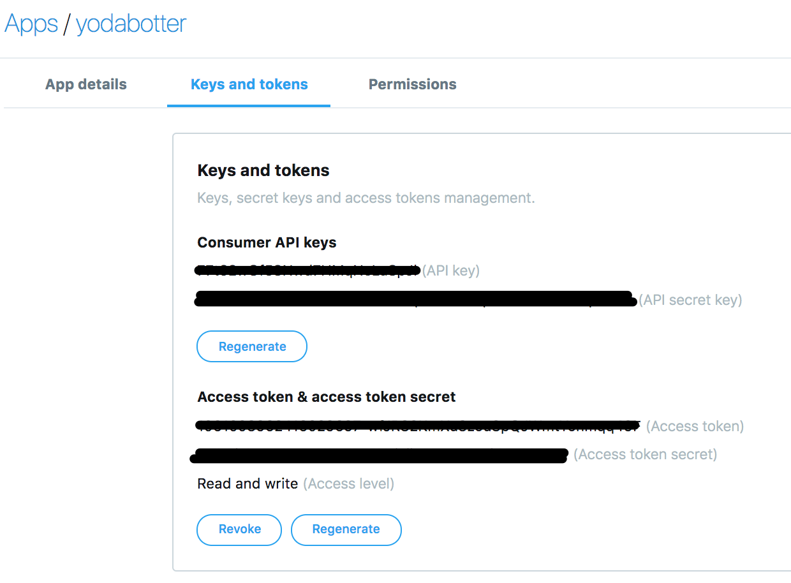

# aws-twitter-bot
Twitter bot based on Lambda

## Overview 

In this builders session, you will build a serverless twitter bot.
There are 2 kind of bots you could build depending on your choice:
1. A simple retweet bot which will look for terms you are interested in and will retweet it automatically.
2. A bot which will update image sent to you based on specific keyword you define

Some of the features that you would be building today are:
- Store your twitter credentials in SSM for reuse
- Trigger event regurlarly to gather tweets
- Retweet automatically
- Store messages in a queue for processing

## Requirements

This workshop requires:

- An active AWS Account with administrative permissions.
- A Cloud9 environment is recommended, but, if you are using your own laptop, you should have AWS-CLI and [git](https://git-scm.com/book/en/v2/Getting-Started-Installing-Git) installed.
- Knowledge of Python will be an added advantage.
- Knowledge of AWS Lambda, Amazon SQS will be an added advantage.
- An active twitter account

### Enable your developer twitter account
[Developer twitter account - get started](https://developer.twitter.com/en/account/get-started)
- To enable your account, you need a valid phone number (verified through a text message with verification code)
- Fill the Account details (personal use, country of operation)
- Fill the use case details (categories, description with 300 characters minimum)
- Sample:
```
1. I am using twitter API to look for tweets related to technological topics or images 
2. I plan to analyze tweets to be able to thank automatically people and also to detect trends in the images, text provided.
3. I will be tweeting content when a given content is interesting.
4. Tweets will be displayed on my timeline.
```
- Finalize your activation   
    - Read the terms of service and accept
    - New verification is sent to your email to confirm the developer account

## Create your twitter application
1. Click on create application
2. Fill the information to give a name and small description (10 words)

3. Put a website URL
4. Check the box for signing in Twitter
5. Put a callback url (not used) so put the same as your website URL

6. Put the description text, reuse the one above when you enabled your developer account.

7. As soon as your application is created, go to the tab named **Keys and tokens**
8. Generate the access tokens

9. These tokens will be used later to authenticate against twitter and make searches, tweets.

### Resources for AWS CLI and SAM CLI:
Interact with AWS environments and twitter through Python:
- SAM CLI: https://docs.aws.amazon.com/serverless-application-model/latest/developerguide/serverless-quick-start.html
- To upgrade to last version of AWS CLI:
  - ```pip install awscli --upgrade --user```
- To upgrade to last version of SAM CLI:
  - ```pip install aws-sam-cli --user```

## Steps:

0. Define the bot you want to do (the simple is Bot 1)
1. [Manage your Twitter credentials in AWS for use in lambdas](./Twitter_credentials/README.md)
2. [Setting up AWS Cloud 9 Development Environment](./AWS_Cloud9/README.md)
3. [Bot 1](./Bot1/README.md)
4. [Bot 2](./Bot2/README.md)


## License Summary

This sample code is made available under a modified MIT license. See the LICENSE file.